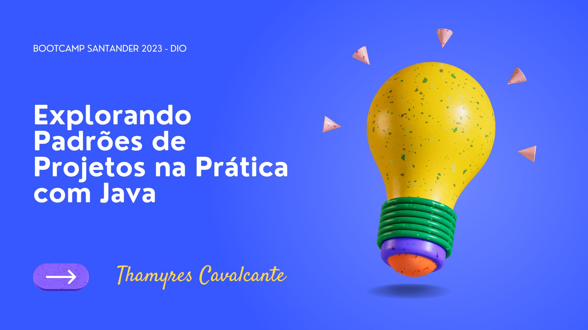

| Desafio | BOOTCAMP SANTANDER 2023 - DIO  |
| -------------  |--------------------------------|
| Nome        | **Explorando Padrões de Projetos na Prática com Java**  
| Tecnologias | Java, Spring Boot, Padrões de projetos                
| URL         | https://github.com/Thamyresmya/Desafio4_Santander_Dio-Padroes-projetos

# Desafio: Explorando Padrões de Projetos na Prática com Java

## 🚀 Tecnologias

Esse projeto foi desenvolvido com as seguintes tecnologias:

- Java 17
- Spring Boot
- Spring Web
- Spring Data JPA
- MySQL
- OpenFeign.
- Git e Github

## ✨ Projeto
Esse projeto desenvolvido com instruções do professor Venilton FalvoJr no [Labs da Digital Innovation One](https://web.dio.me/lab/explorando-padroes-de-projetos-na-pratica-com-java/learning/975a7cad-08ec-43be-9f34-5c3c65aa6ba7). Como base foi utilizado o repositório do instrutor [Padroes-projeto-spring](https://github.com/digitalinnovationone/lab-padroes-projeto-spring). Neste Lab também foram explorados os padrões de projeto Singleton, Strategy e Facade em Java puro.

## 🎯 Desafio

Crie uma solução que explore o conceito de Padrões de Projeto na pŕatica. Para isso, você pode reproduzir um dos projetos que criamos durante as aulas ou, caso se sinta preparado, desenvolver uma nova ideia do zero ;-)

## 🔗 Me siga nas redes sociais:
- [Linkedin](https://www.linkedin.com/in/thamyrescavalcante/)
- [Instagran](https://www.instagram.com/thamyres__cavalcante/)

 

---

### Feito com 💜 by Thamyres Cavalcante